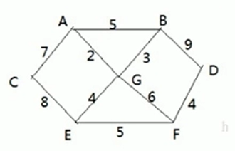

### Dijkstra's Algorithm

人们的出行中离不开地图导航。在这种应用场景中，用户是一个特定的出发点，用户目的地是终点。通常需要找到这两个点之间的最短距离。这种问题称作单源最短路问题。这种问题最流行的算法就是Dijkstra's Algorithm。现在非常常见的导航地图中也都有该算法的影子。我们还是来看一个简单案例，来介绍一下Dijkstra's Algorithm。

#### 1. 问题介绍

问题： 假设现在我们有7个村子'A', 'B', ..., 'G'和6个邮差。他们都从G点出发，需要分别将邮件配送到其他6个村庄。图中的边的权重表示距离。问：如何计算出G村庄到其他各个村庄的最短距离？如果从其他村庄出发到各个村庄的距离又是多少？



#### 2. 问题分析

Dijkstra's Algorithm是典型的单源最短路算法。它的本质上是广度优先遍历（BFS），即从起始点开始一层层向外遍历，直到达到终点为止。

#### 3. Dijkstra's Algorithm过程

1. 设置出发点为 v, 顶点集合为 $V = \{v_1, v_2, ..., v_i \}$，v 到 $V$中各个顶点的距离构成的距离集合为$Dis=\{d_1, d_2, ..., d_i\}$，Dis 集合记录着v 到图中各个顶点的距离（到自身的距离用0表示，v到$v_i$距离为$d_i$
2. 从Dis中选出值最小的$d_i$并移出Dis集合，同时移出$V$集合中对应的顶点$v_i$，此时的v 到$v_i$就是最短路径
3. 更新Dis集合，更新规则为：比较v 到$V$集合中顶点的距离值，与v通过$v_i$到$V$集合中顶点的距离值，保留值较小的一个（同时也应该更新顶点的前驱节点为$v_i$，表明是通过$v_i$到达的）
4. 重复执行2, 3两步，直到最短路径定点为目标定点即可结束。

#### 4. 代码

```java
package Dijkstra;

/*
* Dijkstra's Algorithm: 是一种用于求解单源最短路问题的算法。
* 由于涉及到绘图讲解，所以仍然推荐先阅读DijkstraAlgorithm.md 文件
*
* */

import java.util.Arrays;

// 首先创建一个Graph类：
class Graph {
    private char[] vertex;          // 顶点数组
    private int[][] matrix;         // 邻接矩阵
    private VisistedVertex visited; // 已经被访问过的顶点的集合

    // Constructor
    public Graph(char[] vertex, int[][] matrix) {
        this.vertex = vertex;
        this.matrix = matrix;
    }

    // 显示结果
    public void showDijkstra() {
        visited.show();
    }

    // 打印图：
    public void showGraph() {
        for (int[] link : matrix) {
            System.out.println(Arrays.toString(link));
        }
    }

    // Dijkstra's Algorithm
    public void dijkstra(int index) {
        /**
         * @param index --> 出发顶点的索引
         */
        visited = new VisistedVertex(vertex.length, index);
        update(index);                  // 更新index顶点到周围顶点的距离和前驱顶点
        for (int j = 1; j < vertex.length; j++) {
            index = visited.updateArr();        // 选择并返回新的访问顶点
            update(index);              // 更新index顶点到周围顶点的距离和前驱顶点
        }
    }

    // 更新index下标顶点 到周围顶点的距离和周围顶点的前驱节点
    private void update(int index) {
        int len = 0;
        for (int j = 0; j < matrix[index].length; j++) {        // 遍历邻接矩阵
            len = visited.getDis(index) + matrix[index][j];     // len是 出发顶点到index顶点的距离 + 从index顶点到j顶点的距离之和
            if(!visited.in(j) && len < visited.getDis(j)) {      // 如果顶点j 未被访问，且len < 出发顶点到j顶点的距离，就需要更新
                visited.updatePre(j, index);    // 更新j顶点的前驱节点为index顶点
                visited.updateDis(j, len);      // 更新出发顶点到j顶点的距离
            }
        }
    }
}

// 创建一个VisitedVertex类来表示 当前节点已被访问过
class VisistedVertex {
    public int[] already_arr;   // 记录各个顶点是否被访问过， 1表示访问过，0表示未访问
    public int[] pre_visited;   // 每个下表所对应的值为前一个顶点的下标，会动态更新
    public int[] dis;           // 记录出发顶点到其他所有顶点的距离，如G为出发顶点，就会记录G到其他顶点的距离，并动态更新，求得最短距离会存入dis

    // Constructor:
    public VisistedVertex(int length, int index) {
        /**
         * @param length --> 顶点个数
         * @param index --> 出发顶点所对应的下标，如G点的下标就是6， A就是0
         */
        this.already_arr = new int[length];
        this.pre_visited = new int[length];
        this.dis = new int[length];
        // 初始化 dis 数组，初始值都是65535。但对角线上都是0
        Arrays.fill(dis, 65535);
        this.already_arr[index] = 1;    // 设置出发顶点为 已访问
        this.dis[index] = 0;            // 对角线为0
    }

    public boolean in(int index) {
        /**
         * 判断index顶点是否被访问过
         * @param index
         * @return 如果访问过就返回true，否则false
         */
        return already_arr[index] == 1;
    }

    public void updateDis(int index, int len) {
        /**
         * 更新出发顶点到index顶点的距离
         * @param --> index
         * @param --> len
         */
        dis[index] = len;
    }

    public void updatePre(int pre, int index) {
        /**
         * 更新 pre顶点的前驱节点为index顶点
         * @param --> pre
         * @param index
         */
        pre_visited[pre] = index;
    }

    public int getDis(int index) {
        /**
         * 返回出发顶点到 index顶点的距离
         * @param --> index
         */
        return dis[index];
    }

    // 继续选择并返回新的访问顶点，比如G 访问过之后，就是A 点作为新的访问顶点（注意不是出发顶点）
    public int updateArr() {
        int min = 65535, index = 0;
        for (int i = 0; i < already_arr.length; i++) {
            if (already_arr[i] == 0 && dis[i] < min) {
                min = dis[i];
                index = i;
            }
        }
        // 更新index顶点为已访问
        already_arr[index] = 1;
        return index;
    }

    // 显示最后的结果：
    public void show() {
        // 打印出三个数组的情况
        System.out.println("=======================");
        // 输出already_arr
        for (int i : already_arr) {
            System.out.print(i + " ");
        }
        System.out.println();
        // 打印pre_visited
        for (int i : pre_visited) {
            System.out.print(i + " ");
        }
        System.out.println();
        // 打印dis
        for (int i : dis) {
            System.out.print(i + " ");
        }
        System.out.println();
        // 格式化打印结果
        char[] vertex = {'A', 'B', 'C', 'D', 'E', 'F', 'G'};
        int count = 0;
        for (int i : dis) {
            if (i != 65535) {
                System.out.print("G-->" + vertex[count] + " distance: " + i + "\n");
            } else {
                System.out.println("N ");
            }
            count++;
        }
        System.out.println();
    }
}

public class Dijkstra {
    public static void main(String[] args) {
        char[] vertex = {'A', 'B', 'C', 'D', 'E', 'F', 'G'};
        // 邻接矩阵：
        int[][] matrix = new int[vertex.length][vertex.length];
        final int N = 65535;            // 表示不相连
        matrix[0] = new int[] {N, 5, 7, N, N, N, 2};
        matrix[1] = new int[] {5, N, N, 9, N, N, 3};
        matrix[2] = new int[] {7, N, N, N, 8, N, N};
        matrix[3] = new int[] {N, 9, N, N, N, 4, N};
        matrix[4] = new int[] {N, N, 8, N, N, 5, 4};
        matrix[5] = new int[] {N, N, N, 4, N, N, 6};
        matrix[6] = new int[] {2, 3, N, N, N, 6, N};
        // 创建一个Graph对象
        Graph graph = new Graph(vertex, matrix);
        graph.showGraph();
        // 测试Dijkstra's算法的最终结果
        graph.dijkstra(6);
        graph.showDijkstra();


    }
}

```


