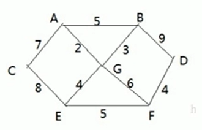

### Dijkstra's Algorithm

人们的出行中离不开地图导航。在这种应用场景中，用户是一个特定的出发点，用户目的地是终点。通常需要找到这两个点之间的最短距离。这种问题称作单源最短路问题。这种问题最流行的算法就是Dijkstra's Algorithm。现在非常常见的导航地图中也都有该算法的影子。我们还是来看一个简单案例，来介绍一下Dijkstra's Algorithm。

#### 1. 问题介绍

问题： 假设现在我们有7个村子'A', 'B', ..., 'G'和6个邮差。他们都从G点出发，需要分别将邮件配送到其他6个村庄。图中的边的权重表示距离。问：如何计算出G村庄到其他各个村庄的最短距离？如果从其他村庄出发到各个村庄的距离又是多少？

