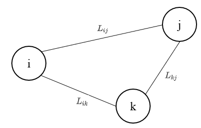
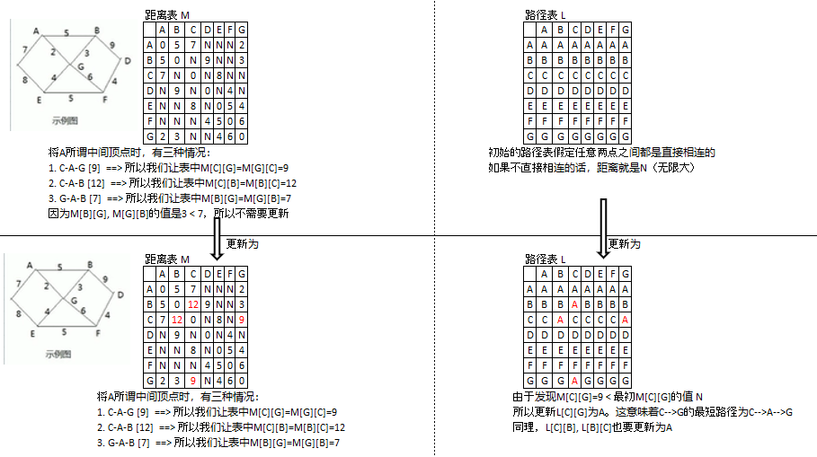

### Floyd Algorithm

#### 1. 介绍

* Floyd Algorithm与Dijkstra's Algorithm一样，也是用于计算给定加权图中顶点之间最短路径的算法。
* 而与Dijkstra's Algorithm不同的是，Dijkstra's Algorithm计算的是某个特定顶点到其他各个顶点之间的最短距离（即单源最短路径）
* Floyd Algorithm则是以图中所有顶点作为出发点，依次计算每个顶点到其余各个顶点之间的最短路径（即多源最短路径）

#### 2. Floyd 算法分析

1. 设置顶点$v_i$到顶点$v_k$的最短路径已知，为$L_{ik}$；顶点$v_k$到$v_j$之间的最短路径已知，为$L_{kj}$；顶点$v_i$到$v_j$的路径为$L_{ij}$。则$v_i$到$v_j$的最短路径为$\min\{L_{ik}+L_{kj}, L_{ij}\}$。$v_k$的取值为图中所有顶点，则可获得$v_i$到$v_j$之间的最短路径。
2. 至于$v_i$到$v_k$之间的最短路径$L_{ik}$和$v_k$到$v_j$之间的最短路径$L_{kj}$，也是用同样的方式计算

（注）上面的$\min\{L_{ik}+L_{kj}, L_{ij}\}$如何理解？我们来看下面的图：



对于任意的的两个节点$v_i$到$v_j$来说，最短距离一定是 $L_{ij}$ 和 $L_{ik}+L_{kj}$ 之中较小的一个。我们来看下面的图，理解一下Floyd算法。

1. 首先我们有一个距离表M和一个路径表L。$M[i][j]$表示当前 节点$v_i$到$v_j$的最小距离（该最小距离是会逐步更新的）。$L[i][j]$表示节点$v_i$到$v_j$的路径。最初我们假定图中任意两点之间都是相连的，如果不相连就在距离表中用N来表示（距离无限大）。
2. 然后我们取A节点作为中间节点（也就是上面的$v_k$），发现以A节点为中间节点的一共有3种（C-A-G [9], C-A-B [12],  G-A-B[7]）。我们分别来看这三种情况，我们将使用上面的$\min\{L_{ik}+L_{kj}, L_{ij}\}$来更新这两张表:
   * 因为新的C-A-G 的距离为9，小于距离表M中的$M[C][G]$和$M[G][C]$，所以我们更新$M[C][G]$和$M[G][C]$为9；
   * 对于新的C-A-B，同理将$M[A][B]$和$M[B][A]$更新为12；
   * 但是要注意，对于新的G-A-B，由于其距离为7，而初始的$M[G][B]$和$M[B][G]$为3，所以不需要更新$M[G][B]$和$M[B][G]$

3. 如此重复上面的步骤2，完成M, L两张表的更新。



#### 代码实现

```java
package Floyd;

/*
* Floyd Algorithm： 与Dijkstra's Algorithm一样，也是用于计算给定加权图中顶点之间最短路径的算法。
* 而与Dijkstra's Algorithm不同的是，Dijkstra's Algorithm计算的是某个特定顶点到其他各个顶点之间的最短距离（即单源最短路径）
* Floyd Algorithm则是以图中所有顶点作为出发点，依次计算每个顶点到其余各个顶点之间的最短路径（即多源最短路径）
*
* 受限于文本格式，我们还是在 Floyd.md中详细讲解Floyd Algorithm
* */

import java.util.Arrays;

// 创建一个图类
class Graph {
    private char[] vertex;      // 存放顶点的数组
    private int[][] dis;        // 从各个顶点出发到其他各个顶点的距离。dis 也是Floyd算法的最终结果。相当于Floyd.md中的 M 表（距离表）
    private int[][] pre;        // 前驱节点，相当于Floyd.md中的 L 表（路径表）

    // Constructor
    public Graph(int length, int[][] matrix, char[] vertex) {
        /**
         * @param --> length 节点的个数
         * @param --> matrix 邻接矩阵
         * @param --> vertex 顶点数组
         */
        this.dis = matrix;
        this.vertex = vertex;
        this.pre = new int[length][length];

        // 初始化 pre 路径表
        for (int i = 0; i < length; i++) {
            Arrays.fill(pre[i], i);
        }
    }

    // 显示dis 距离数组 和 pre 路径数组
    public void show() {
        for (int k = 0; k < this.dis.length; k++) {
            // 输出 pre路径数组
            for (int i = 0; i < this.dis.length; i++) {
                System.out.print("\t\t " + vertex[pre[k][i]] + "  \t\t");
            }
            System.out.println("\n===================================================================================================================================");
            // 输出 dis距离数组
            for (int i = 0; i < this.dis.length; i++) {
                System.out.print("| " + vertex[k] + "到" + vertex[i] + "的最短路径是" + dis[k][i] + " |");
            }
            System.out.println();
        }
    }

    // Floyd Algorithm
    public void floyd() {
        int len = 0;        // 保存距离
        for (int k = 0; k < dis.length; k++) {          // 从中间顶点遍历，k是中间顶点的下标
            for (int i = 0; i < dis.length; i++) {      // 从 i顶点开始出发
                for (int j = 0; j < dis.length; j++) {  // j 是终止节点
                    len = dis[i][k] + dis[k][j];        // 求出从 i顶点出发，且经过 k顶点，且到达 j顶点 这条路径的距离
                    if (len < dis[i][j]) {              // 如果经过k顶点这条路径的距离小于 距离表dis 中已有的值，就替换为较小的值
                        dis[i][j] = len;
                        pre[i][j] = pre[k][j];          // 更新前驱节点（更新路径表）
                    }
                }
            }
        }
    }
}


public class Floyd {

    public static void main(String[] args) {
        char[] vertex = {'A', 'B', 'C', 'D', 'E', 'F', 'G'};
        int[][] matrix = new int[vertex.length][vertex.length];
        final int N = 65535;            // 表示不相连
        matrix[0] = new int[] {N, 5, 7, N, N, N, 2};
        matrix[1] = new int[] {5, N, N, 9, N, N, 3};
        matrix[2] = new int[] {7, N, N, N, 8, N, N};
        matrix[3] = new int[] {N, 9, N, N, N, 4, N};
        matrix[4] = new int[] {N, N, 8, N, N, 5, 4};
        matrix[5] = new int[] {N, N, N, 4, N, N, 6};
        matrix[6] = new int[] {2, 3, N, N, N, 6, N};

        Graph graph = new Graph(7, matrix, vertex);
        graph.floyd();
        graph.show();
    }
}

```


