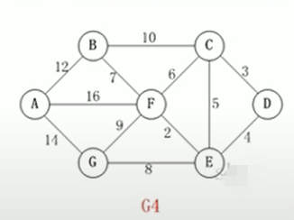
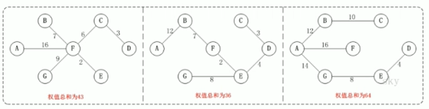
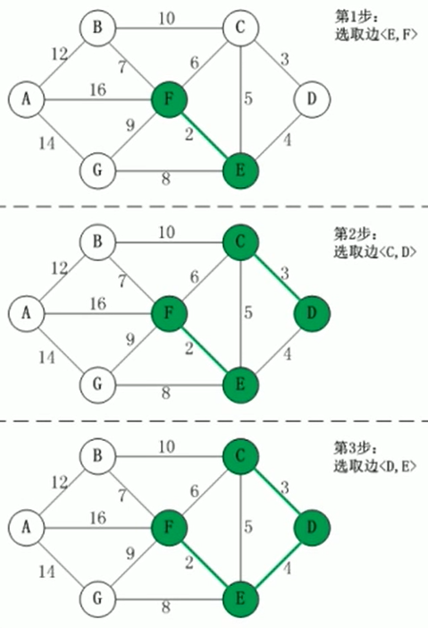
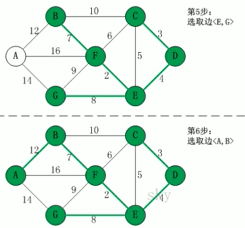
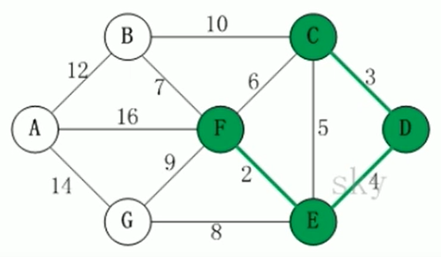

### Kruskal Algorithm

Kruskal Algorithm: Kruskal 也是用于查找最小生成树的算法。
* PRIM Algorithm是从一个节点开始出发，逐个寻找下一个权重最小的边，直到找到最小生成树为止
* Kruskal Algorithm则是先找到所有权重最小的边，然后找到所有权重次最小的边…… 直到被找到的边能构成一个最小生成树 为止。

#### 1. 应用案例

我们还是通过一个应用案例来介绍Kruskal Algorithm。假设我们有下图所示的7个村庄，7个村庄之间的距离用权重来表示，且7个村庄之间没有道路相连。现在，我们想在这7个村庄之间修路，连接7个村庄的同时，保证道路总里程最短。



#### 2. Kruskal Algorithm介绍

1. 基本思想：按照权重从小到大的顺序 选出 n - 1条边，并保证这 n - 1条边不构成 [环](https://zh.wikipedia.org/wiki/%E7%92%B0_(%E5%9C%96%E8%AB%96))。
2. 具体做法：首先构造一个只有n 个顶点的森林，然后按照权重从小到大的顺序，连通网 中选择边 加入到森林中，并使森林中不产生环，直到森林变成一棵树为止。

#### 3. 问题分析

对于上面给定的问题来说，下面是几个可能的最小生成树：



我们看到不同的最小生成树有不同的总权重值。

假设现在我们用 R 来保存当前最小生成树的结果那么：




（注意）第四步中选择CE或CF会构成环，所以只能选BF



上面的过程应该比较易懂。现在的问题在于：

1. 如果对图中所有的边按照权重大小进行排序
2. 在将边添加到最小生成树R 中时，如何判断是否构成了环

对于问题1，我们可以用排序算法进行排序

对于问题2，我们需要记录顶点在最小生成树中的终点，顶点的终点是”在最小生成树中与它连通的最大顶点“。然后每次需要将一条边添加到最小生成树时，判断该边的两个顶点的终点是否重合，重合的话则会构成环。

我们通过之前的第四步来理解问题2的解法：



在这一步时，虽然CF, CE的权重小，但是会构成环，因此只能选BF。现在已经加入到最小生成树R的边有CD, DE, EF。我们创建一个对应关系：

* C的终点是F
* D的终点是F
* E的终点是F
* F的终点是F

有了这个对应关系后，虽然CE是权重较小的边，但C, E两个顶点的终点都是F，所以有着相同的终点。因此如果加入CE边的话，会构成环。用这种方式就可以判断是否构成环了。

```java
package Kruskal;

/*
* Kruskal Algorithm: Kruskal 也是用于查找最小生成树的算法。
* PRIM Algorithm是从一个节点开始出发，逐个寻找下一个权重最小的边，直到找到最小生成树为止
* Kruskal Algorithm则是先找到所有权重最小的边，然后找到所有权重次最小的边…… 直到被找到的边能构成一个最小生成树 为止。
*
*
*
* */

import java.util.Arrays;

// 定义一个边类，它的对象实例表示一条边
class edgeData {
    char start, end;        // 边的起点和终点
    int weight;             // 边的权重

    // Constructor
    public edgeData(char start, char end, int weight) {
        this.start = start;
        this.end = end;
        this.weight = weight;
    }
    // 重写toString 函数：
    @Override
    public String toString() {
        return "edgeData [<" + start + ", " + end + "> = " + weight + "]";
    }
}


public class Kruskal {
    private int edgeNum;        // 边的个数
    private char[] vertex;      // 顶点数组
    private int[][] matrix;     // 邻接矩阵
    // 使用INF表示两个节点之间不连通
    private static final int INF = Integer.MAX_VALUE;

    // Constructor:
    public Kruskal(char[] vertex, int[][] matrix) {
        int vlen = vertex.length;
        // 初始化顶点
        this.vertex = new char[vlen];
        for (int i = 0; i < vertex.length; i++) {
            this.vertex[i] = vertex[i];
        }
        this.matrix = new int[vlen][vlen];      // 初始化边
        for (int i = 0; i < vlen; i++) {
            for (int j = 0; j < vlen; j++) {
                this.matrix[i][j] = matrix[i][j];
            }
        }
        // 统计边
        for(int i = 0; i < vlen; i++) {
            for (int j = i+1; j < vlen; j++) {
                if (this.matrix[i][j] != INF) {
                    edgeNum++;
                }
            }
        }
    }

    public void kruskal() {
        int index = 0;                  // 表示最后结果数组的索引
        int[] ends = new int[edgeNum];  // 保存”已有最小生成树“中的每个顶点在最小生成树中的终点
        edgeData[] results = new edgeData[edgeNum]; // 保存最后的最小生成树
        edgeData[] edges = getEdges();      // 获取图中所有边的 集合
        System.out.println("图的边的集合=" + Arrays.toString(edges) + " 共" + edges.length);  // 12条

        // 按照边权重大小进行排序
        sortEdge(edges);
        // 遍历edges数组， 将边添加到最小生成树中，判断准备加入的边是否构成了环
        for (int i = 0; i < edgeNum; i++) {
            // 获取第i条边的第一个顶点：
            int p1 = getPosition(edges[i].start);
            // 获取第i条边的第2个顶点：
            int p2 = getPosition(edges[i].end);

            // 获取p1顶点在已有的最小生成树中的终点
            int m = getEnd(ends, p1);
            // 获取p2顶点在已有的最小生成树中的终点
            int n = getEnd(ends, p2);

            // 判断是否构成环：
            if (m != n) {       // 没构成环
                ends[m] = n;    // 设置m 在”已有最小生成树“中的终点
                results[index++] = edges[i];    // 有一条边加入到results
            }
        }
        // 打印出”最终的最小生成树“results
        System.out.println("最终的最小生成树为： ");
        for (int i = 0; i < index; i++)
            System.out.println(results[i]);
    }

    // Print 邻接矩阵
    public void print() {
        System.out.println("邻接矩阵： \n");
        for (int i = 0; i < vertex.length; i++) {
            for (int j = 0; j < vertex.length; j++) {
                System.out.printf("%13d", matrix[i][j]);
            }
            System.out.println();
        }
    }

    // 对边的权重进行排序（冒泡）：
    private void sortEdge(edgeData[] edges) {
        /**
         * @param --> 边的集合
         */
        for (int i = 0; i < edges.length - 1; i++) {
            for (int j = 0; j < edges.length - 1 - i; j++) {
                if (edges[j].weight > edges[j+1].weight) {
                    edgeData temp = edges[j];
                    edges[j] = edges[j+1];
                    edges[j+1] = temp;
                }
            }
        }
    }

    private int getPosition(char ch) {
        /**
         * @param ch --> 顶点的值， 如'A', 'B', ...
         * @return --> 返回ch顶点对应的下标，如果找不到，返回-1
         */
        for (int i = 0; i < vertex.length; i++) {
            if (vertex[i] == ch) { return i; }
        }
        return -1;
    }

    private edgeData[] getEdges() {
        /**
         * @return --> 返回图中的边，放到edgeData[] 数组中，便于我们之后遍历该数组
         * 通过matrix 邻接矩阵来获取
         * edgeData[] 形式： [['A', 'B', 12], ['B', 'F', 7], ... ]
         */
        int index = 0;
        edgeData[] edges = new edgeData[edgeNum];
        for (int i = 0; i < vertex.length; i++) {
            for (int j = i+1; j < vertex.length; j++) {
                if (matrix[i][j] != INF) {
                    edges[index++] = new edgeData(vertex[i], vertex[j], matrix[i][j]);
                }
            }
        }
        return edges;
    }

    private int getEnd(int[] ends, int i) {
        /**
         * 获取下标为 i 的顶点的终点，判断两个顶点的终点是否相同
         * @param --> ends 记录了各个顶点所对应的顶点。ends数组是在遍历过程中逐步形成的
         * @param --> i 表示传入的顶点所对应的下标
         * @return --> 返回下表为 i 的顶点  所对应的终点的下标
         */
        while (ends[i] != 0) {
            i = ends[i];
        }
        return i;
    }

    public static void main(String[] args) {
        char[] vertex = {'A', 'B', 'C', 'D', 'E', 'F', 'G'};
        int matrix[][] = {
                {0, 12, INF, INF, INF, 16, 14},
                {12, 0, 10, INF, INF, 7, INF},
                {INF, 10, 0, 3, 5, 6, INF},
                {INF, INF, 3, 0, 4, INF, INF},
                {INF, INF, 5, 4, 0, 2, 8},
                {16, 7, 6, INF, 2, 0, 9},
                {14, INF, INF, INF, 8, 9, 0},
        };
        // 创建一个Kruskal对象实例
        Kruskal kruskal = new Kruskal(vertex, matrix);
        kruskal.print();

        // 未排序的边：
        edgeData[] edges = kruskal.getEdges();
        System.out.println("未排序的边: " + Arrays.toString(kruskal.getEdges()));
        // 排序后的边：
        kruskal.sortEdge(edges);
        System.out.println("排序的后边: " + Arrays.toString(edges));

        // 打印出最终的最小生成树
        kruskal.kruskal();
    }
}
```


